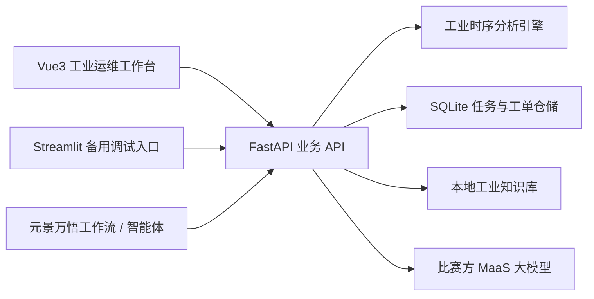

# 时察千机：工业时序智能体

> 面向浙江省国际大学生创新大赛人工智能赛道“时序工业类”命题的工业时序异常诊断与运维决策系统。

时察千机将工业多变量传感器数据转化为可追溯的风险判断、异常证据、趋势预测、根因候选和运维工单，并通过现场反馈沉淀历史故障案例。当前校赛阶段使用公开 SKAB 数据集完成工程验证，企业真实数据接入后主要替换数据适配和设备知识，不改变整体应用闭环。

## 项目定位

本项目不是单纯的聊天机器人，也不是只输出一个异常标签的检测脚本，而是一套面向工业运维闭环的时序智能体：

```text
工业 CSV
  -> 数据质量检查与数据画像
  -> 多变量时序异常检测
  -> 连续异常事件合并与传感器归因
  -> 趋势预测与工况上下文分析
  -> 根因候选、证据缺口和验证步骤
  -> 生成优先级运维工单
  -> 现场确认、处置与复测反馈
  -> 历史案例沉淀与相似案例检索
```

工业数值计算由 Python 算法完成；大模型只用于受控的知识检索、结果解释和自然语言交互，不直接读取整份原始 CSV 猜测故障。这样可以保留算法可复现性、证据链和工程边界，也能降低比赛接口限流对核心分析的影响。

每次分析还会生成一条“自动分析链路”，记录文件接入、设备匹配、数据画像、异常检测、工况识别、
证据提取、趋势预测、根因排序和工单草案生成的执行状态、模块、核心输出与耗时。它记录的是系统
实际调用过的工具事实，不记录大模型隐式思维过程；前端总览和 Markdown 报告均可查看这条链路。

## 当前版本

当前代码已经形成可运行的校赛验证版本：

- 支持 SKAB 及通用多变量 CSV 数据上传，并可自动匹配设备数据契约；
- 支持数据画像、缺失值检查和浏览器端文件预检；
- 支持 MAD、Isolation Forest、PCA 重构、滑动窗口 AutoEncoder、Hybrid 和时频关系多路径检测；
- 支持根据任务目标、设备配置、数据规模和健康基线自动选择主模型，并保留完整候选排序；
- 支持四类互补模型交叉验证；严格多数共识经独立测试未优于主模型，当前仅用于可信度证据；
- 支持异常事件合并、风险分级、主导传感器归因；
- 支持工况分段、传感器关系变化和领先/滞后线索分析；
- 支持最近值、指数平滑、局部线性、滞后岭回归和时频增强岭回归预测，并按滚动回测选择模型；
- 支持固定时间尾段预测评估与受控退化预警实验，量化基线改善、区间覆盖、方向判断和预警提前量；
- 支持候选根因、支持证据、证据缺口和现场验证步骤；
- 支持异步分析任务、任务状态轮询、取消排队任务和历史任务归档；
- 支持运维工单状态流转、现场反馈、归档和历史案例沉淀；
- 支持 Vue3 工业运维工作台和 Streamlit 备用调试页面；
- 支持一键登记默认 SKAB 样例，便于没有企业数据时完成完整演示；
- 支持为元景万悟提供专用 OpenAPI 和工作流工具接口。

当前结果只能作为 SKAB 校赛阶段验证，不应包装为企业现场成效。企业数据和企业设备知识库接入后，还需要重新标定阈值、模型和根因规则。

## 系统架构



三部分职责不同：

| 部分 | 主要职责 | 当前用途 |
| --- | --- | --- |
| Vue3 前端 | 图表、风险总览、异常证据、预测、工单和历史案例 | 正式产品界面和竞赛演示主界面 |
| FastAPI 后端 | 文件接收、异步任务、算法调用、数据库读写、万悟接口 | 前后端和平台之间的业务服务层 |
| 万悟平台 | 用户登录、智能体、工作流、知识库和模型编排 | 后续平台化展示与智能交互 |

风险总览中的“自动分析链路”来自后端 `execution_trace` 字段。标准分析接口和本地历史任务返回完整步骤；
万悟快速诊断接口只返回紧凑摘要，以控制上下文长度和模型调用额度。

Vue3 不会因为导入 OpenAPI 自动出现在万悟网页内部。OpenAPI 只让万悟能够调用 FastAPI 接口。后续若万悟支持外部应用嵌入，才可以把部署后的 Vue 页面作为独立工作台嵌入；在校赛阶段采用“万悟智能体入口 + Vue3 专业看板”的双界面方式更稳妥。

## 目录结构

```text
shichi_qianji_agent/
├─ app/
│  ├─ analysis/                 # 数据画像、异常检测、预测、工况和流程编排
│  ├─ api/                      # FastAPI 接口、异步任务和万悟 OpenAPI
│  ├─ data/                     # CSV 加载与字段适配
│  ├─ diagnosis/                # 确定性根因排序、知识检索和诊断服务
│  ├─ experiments/              # 基准、消融、阈值调优和竞赛实验
│  ├─ integrations/             # 万悟文件接收、平台自检等适配
│  ├─ knowledge/                # 工业知识检索与向量索引
│  ├─ llm/                      # 大模型客户端、限流和降级策略
│  ├─ model_store/              # AutoEncoder 等模型的版本化存储
│  ├─ observability/            # 运行日志与可追溯记录
│  ├─ reporting/                # 报告、案例材料包和证据包
│  ├─ storage/                  # SQLite 仓储、任务、工单和案例
│  ├─ ui/                       # Streamlit 备用页面
│  ├─ cli.py                    # 命令行入口
│  └─ config.py                 # .env 配置读取
├─ frontend/                    # Vue3 + Vite 正式产品前端
│  ├─ src/App.vue               # 页面状态和整体布局
│  ├─ src/api.js                # FastAPI 请求封装
│  └─ src/components/           # 工单、历史、图表和弹窗组件
├─ resources/knowledge/         # 工业知识库文档
├─ tests/                       # 后端和核心流程测试
├─ docs/                        # 运行、算法和万悟接入文档
├─ scripts/                     # 基础服务启动、停止和检查脚本
├─ outputs/                     # 本地数据库、上传文件、日志和实验产物
├─ SKAB/                        # 外部数据集，与项目目录并列，不纳入本仓库
├─ .env                         # 本机密钥和路径，不提交
├─ .env.example                 # 可公开的配置模板
├─ api_main.py                  # FastAPI 启动入口
├─ main.py                      # 命令行分析和实验入口
├─ streamlit_app.py             # Streamlit 备用入口
└─ pyproject.toml               # uv、Python 依赖和命令配置
```

## 数据与知识库

SKAB 与项目目录并列：

```text
E:\大学课程\竞赛\SKAB
E:\大学课程\竞赛\shichi_qianji_agent
```

默认样例由根目录 `.env` 配置：

```dotenv
SKAB_DEFAULT_FILE=../SKAB/data/valve1/0.csv
SKAB_DEFAULT_DIR=../SKAB/data/valve1
HEALTHY_BASELINE_FILE=../SKAB/data/anomaly-free/anomaly-free.csv
```

项目不把完整 SKAB 数据集提交到 GitHub。后续企业数据也建议放在项目外部，通过前端上传或 `.env` 指向数据目录。不同设备字段、单位、采样约定和健康基线通过 `resources/device_profiles/` 下的 JSON 配置适配，分析算法继续使用统一标准字段。

设备配置采用“显式指定、自动匹配、通用回退”三层机制：

```text
resources/device_profiles/
├─ skab_valve.json          # 已启用的 SKAB 阀门测试台配置
└─ enterprise_template.json # 企业设备模板，信息未确认前保持停用
```

接入一类企业设备时，复制模板并完成以下内容：设备编号与版本、时间列和字段别名、必需与可选测点、单位与测点类别、采样周期、经企业确认的安全范围、健康基线路径、推荐检测参数和适用边界。不能确认的单位或阈值应保留为 `null`，不得为了页面完整而编造。

知识库文档放在：

```text
resources/knowledge/
```

当前知识库应优先保持“小而可靠”，每份资料保留标题、适用设备、故障现象、可观测信号、验证方法、处置建议和来源信息。企业手册、告警规则和维修工单接入后，再扩充设备专属知识。

## 环境准备

项目使用 uv 管理 Python 环境，当前要求 Python 3.13 或更高版本；前端使用 Node.js 和 npm。

```powershell
cd "E:\大学课程\竞赛\shichi_qianji_agent"
& "E:\Tools\uv\uv.exe" sync
```

首次启动前配置本地环境变量：

```powershell
Copy-Item .env.example .env
```

然后编辑 `.env`，至少检查：

```dotenv
DATABASE_PATH=outputs/shichi_qianji.db
LLM_API_KEY=你的比赛方接口密钥
LLM_BASE_URL=https://maas-api.ai-yuanjing.com/openapi/compatible-mode/v1
LLM_CHAT_MODEL=glm-5
FRONTEND_ALLOWED_ORIGINS=http://localhost:5173,http://127.0.0.1:5173
```

真实密钥只能写入本地 `.env`，不要写进代码、截图、前端源码或 GitHub。

## 启动方式

### A. 启动 Vue3 正式前端

先开一个终端启动后端：

```powershell
cd "E:\大学课程\竞赛\shichi_qianji_agent"
& "E:\Tools\uv\uv.exe" run python api_main.py
```

再开第二个终端启动前端：

```powershell
cd "E:\大学课程\竞赛\shichi_qianji_agent\frontend"
& "E:\Tools\nodejs\npm.cmd" install
& "E:\Tools\nodejs\npm.cmd" run dev
```

浏览器访问：

```text
http://127.0.0.1:5173
```

后端健康检查：

```powershell
Invoke-RestMethod http://127.0.0.1:8000/health
```

前端通过 `frontend/.env` 中的 `VITE_API_BASE_URL` 调用后端，默认值为 `http://127.0.0.1:8000`。前端不直接访问数据库，也不保存大模型密钥。

### B. 只运行后端接口

```powershell
cd "E:\大学课程\竞赛\shichi_qianji_agent"
& "E:\Tools\uv\uv.exe" run python api_main.py
```

API 文档：

```text
http://127.0.0.1:8000/docs
http://127.0.0.1:8000/openapi.json
```

服务自检摘要：

```powershell
Invoke-RestMethod http://127.0.0.1:8000/api/v1/system/diagnostics | ConvertTo-Json -Depth 6
```

该接口只返回数据库、知识库、SKAB 样例、模型配置、限流参数和任务队列是否就绪，
不返回 API Key、服务器绝对路径、原始 CSV 或数据库内容。`status=ready` 表示当前环境可直接演示；
`status=degraded` 表示基础服务仍可运行，但有需要关注的配置提醒。

### C. 运行 Streamlit 备用页面

Streamlit 仍保留用于算法调试、离线验证和没有 Node 环境时的备用演示，不是 Vue3 的替代启动方式：

```powershell
cd "E:\大学课程\竞赛\shichi_qianji_agent"
& "E:\Tools\uv\uv.exe" run streamlit run streamlit_app.py
```

浏览器访问：

```text
http://127.0.0.1:8501
```

### D. 联动本地万悟

只有需要验证平台接入时才启动万悟。Docker 基础模式和本地连接说明见：

```text
docs/BASIC_MODE_RUNBOOK.md
docs/LOCAL_WANWU_RUNBOOK.md
docs/WANWU_INTEGRATION.md
```

本地万悟网页通常为：

```text
http://localhost:8081
```

万悟调用时察千机 API 使用：

```text
http://host.docker.internal:8000/integrations/wanwu/quick-openapi.json
```

比赛演示优先使用工作流：

```text
文件输入 -> quick_industrial_diagnosis -> 结束节点直接返回 presentation
```

不要在快速工作流后再叠加普通智能体大模型总结，否则容易产生额外调用和限流。

未显式填写 `detector` 时，产品 API 默认采用自动模型选择；显式填写模型时进入手动模式，
用于固定实验和人工复核。可通过 `analysis_goal` 指定 `balanced`、`high_recall`、
`low_false_alarm`、`relationship_fault`、`nonlinear_pattern` 或 `fast_screening`。

## 主要接口

| 接口 | 用途 |
| --- | --- |
| `POST /api/v1/files` | 上传 CSV 并返回 `file_id` |
| `POST /api/v1/samples/skab/default` | 登记默认 SKAB 样例并返回可分析的 `file_id` |
| `GET /api/v1/files/{file_id}/preflight` | 返回受控 CSV 的真实行数、列名、测点数、缺失率和设备配置匹配结果 |
| `GET /api/v1/device-profiles` | 返回可选择的设备配置摘要 |
| `POST /api/v1/jobs` | 创建异步分析任务 |
| `GET /api/v1/jobs/{run_id}` | 查询任务状态 |
| `GET /api/v1/jobs/{run_id}/result` | 获取分析结果 |
| `GET /api/v1/runs` | 查询历史分析任务 |
| `GET /api/v1/work-orders` | 查询运维工单，可按 `run_id`、状态和优先级筛选 |
| `PATCH /api/v1/work-orders/{record_id}` | 保存现场反馈 |
| `GET /api/v1/cases` | 查询历史确认案例 |
| `POST /api/v1/wanwu/quick-diagnosis` | 万悟快速诊断入口 |
| `POST /api/v1/wanwu/jobs/submit` | 万悟异步任务入口 |

完整万悟接口说明见 `docs/WANWU_INTEGRATION.md`。

## 数据库与文件

当前使用 SQLite，默认数据库为：

```text
outputs/shichi_qianji.db
```

数据库保存：

- 上传文件元数据；
- 分析任务状态和结构化结果；
- 工单状态、现场确认根因和复测反馈；
- 已确认历史案例；
- 归档时间和操作原因。

原始 CSV 保存在 `outputs/api_uploads/`，不直接写入数据库；报告、实验结果、限流状态和模型缓存也保存在 `outputs/` 下。`outputs/` 中的运行产物不会提交 GitHub。

正式企业部署时再迁移到 PostgreSQL，并增加对象存储、用户身份、组织隔离、权限和审计日志。校赛阶段不需要先实现独立用户登录；后续接入万悟时优先复用万悟的登录体系。

## 实验与成果材料

```powershell
# 离线基础自检
& "E:\Tools\uv\uv.exe" run python main.py --check

# 生成校赛实验汇总
& "E:\Tools\uv\uv.exe" run python main.py --competition-report

# 生成案例材料包
& "E:\Tools\uv\uv.exe" run python main.py --case-package --file ..\SKAB\data\valve1\0.csv

# 评价趋势预测与提前预警成效
& "E:\Tools\uv\uv.exe" run python main.py --evaluate-forecast --data-root ..\SKAB\data

# 生成证据包
& "E:\Tools\uv\uv.exe" run python main.py --evidence-pack --case-count 3
```

`--evidence-pack` 会在同一目录生成实验汇总、`other` 场景误报审计、三类典型案例和答辩索引：

```text
outputs/evidence_pack/
├─ EVIDENCE_PACK_INDEX.md
├─ experiments/
│  ├─ skab_competition_summary.md
│  ├─ forecast_effectiveness_*.md
│  ├─ forecast_backtest_*.csv
│  ├─ controlled_warning_*.csv
│  ├─ time_frequency_relation_false_positive_analysis.md
│  ├─ time_frequency_relation_false_positive_events.csv
│  └─ time_frequency_relation_system_effectiveness.md
└─ cases/
   ├─ other/1/
   ├─ valve1/0/
   └─ valve2/0/
```

误报审计将独立测试集中的未匹配告警按“工况变点附近、工况切换期、传感器质量风险、待解释误报”分类，
用于解释 `other` 场景的告警来源。分类结果是公开数据实验线索，不等于企业现场故障结论；正式接入企业日志后仍需人工复核。

系统成效报告统计异常事件证据、候选根因诊断和工单草案的覆盖率。它只衡量公开数据上的系统输出完整性，
不代表诊断正确率或企业现场处置效率。也可以单独运行：

    uv run python main.py --system-effectiveness --data-root ..\SKAB\data

趋势预测实验在 17 份固定独立测试文件的 136 条传感器序列上保留最后 30 个采样点，
仅使用此前历史滚动选模。自动策略相对最近值持续模型的标准化 RMSE 平均改善 4.75%，
经验 95% 区间覆盖率为 95.12%。另有四类固定种子的受控退化场景用于验证提前预警机制，
它们不是企业数据或设备工程阈值；完整口径见 `docs/competition/SKAB_RESULTS.md`。

输出目录主要包括：

```text
outputs/competition/       实验汇总和指标
outputs/cases/             典型案例材料
outputs/evidence_pack/     网评与答辩证据包
outputs/api_uploads/       API 接收的 CSV
outputs/logs/              运行日志
outputs/shichi_qianji.db   SQLite 数据库
```

## 测试

```powershell
cd "E:\大学课程\竞赛\shichi_qianji_agent"
& "E:\Tools\uv\uv.exe" sync --extra dev
& "E:\Tools\uv\uv.exe" run pytest -q
```

如果 Windows 临时目录权限导致 `pytest` 报错，可将临时目录改到项目内已有可写目录后再运行；`tmp_path` 权限错误不等于业务测试失败。

前端构建检查：

```powershell
cd "E:\大学课程\竞赛\shichi_qianji_agent\frontend"
& "E:\Tools\nodejs\npm.cmd" run build
```

## 当前边界与下一步

当前项目处于“校赛可演示、企业数据待接入”的阶段。现有 SKAB 结果用于验证算法流程和工程闭环，不代表联通企业现场成效。

当前已经完成：

1. 固定 SKAB 文件划分、阈值调优、独立测试和消融实验；
2. 生成实验协议、模型横向对比和相对 MAD 基线的竞赛成效表；
3. 完成 Vue3 + FastAPI 的上传、分析、证据查看、工单确认和历史案例闭环；
4. 建立小而可靠的通用工业知识库，并保留后续企业文档替换入口；
5. 完成独立测试集误报审计，并将 `other → valve1 → valve2` 三类案例纳入成果包。
6. 完成 SKAB 时间尾段预测评估和受控退化提前预警实验，并纳入成果包。

下一步按优先级推进：

1. 获取企业时序数据后，按设备配置重新标定阈值、模型和设备专属根因规则；
2. 用企业时序数据和运行日志复核误报分类，形成可引用的企业案例证据；
3. 根据比赛方万悟配置确定公网部署和工作流发布方式；
4. 企业部署阶段再迁移 PostgreSQL，并增加用户身份、组织隔离、权限和审计日志。

稳定的 GitHub 可公开实验摘要见 [`docs/competition/SKAB_RESULTS.md`](docs/competition/SKAB_RESULTS.md)。

## GitHub 提交边界

建议提交：

- `app/`、`frontend/src/`、`frontend/package.json`、`frontend/package-lock.json`；
- `tests/`、`docs/`、`scripts/`；
- `.env.example`、`frontend/.env.example`；
- `README.md` 和算法说明。

不要提交：

- `.env` 和任何真实 API Key；
- `frontend/node_modules/`、`frontend/dist/`；
- `.venv/`、缓存、日志和 `outputs/` 运行产物；
- 完整 SKAB 数据集、企业原始数据和内部设备文档。

`.gitignore` 已经配置上述忽略规则。
